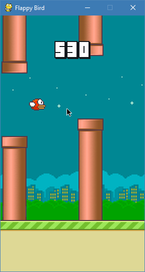
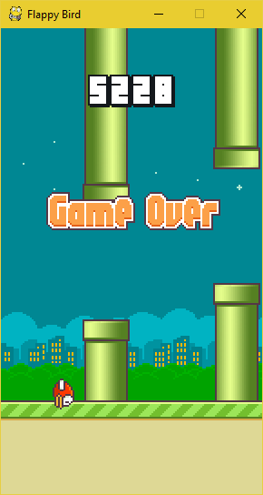
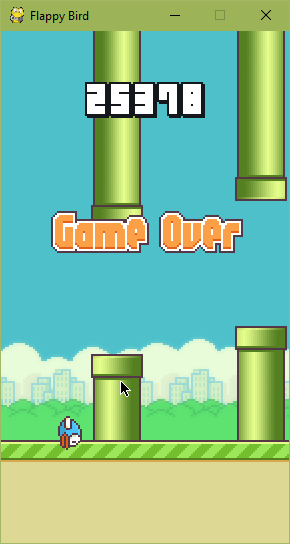

# Flappy_Bird_Reinforcement_Learning 
This is a simple Reinforcement Learning application on Flappy bird game.

Flappy Bird
===============

Flappy Bird game used in this project is used from repository: `https://github.com/sourabhv/FlappyBirdClone`

Installation Guide
------------------

1. Python 3.5.x and PyGame 1.9.X is required

2. Clone this repository: `https://github.com/tarunk04/flappy_bird_reinforcement_learning`.

3. Run `python train.py`.

4. Wait for training to be done (Models will be saved in the folder `Models` of the repository).

5. Run `python flappy.py` enter location of trained model and press `Enter` to see the performance of the model. 

**NOTE**
Trained model is already provided in the folder `Models/Samples/flappy_bird_model_final.h5`. Run `python flappy.py` and enter anything as text to load default path and enjoy...

ScreenShot
----------

 

High Score
----------
High Score so far achieved using the trained model ( provided in `models/samples/`) is : **25378**

